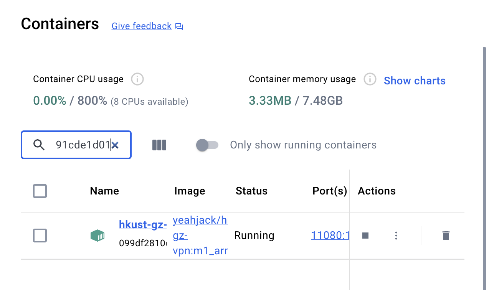

## Usage

When we are not in campus, we need to use ivanti VPN to connect to our network. But the ivanti VPN is not stable and will occupy the port so we are not able to use the Clash X or other VPN tools to use the ChatGPT or other services. 

Thanks to [yeahjack](https://github.com/yeahjack/hkust-gz-vpn-docker), we are able to use the docker to connect the HKUST-GZ VPN and use Clash at the same time.

## Tutorials

### Step 1: Install Docker

Firstly, we need to install Docker on our local machine. You can download the Docker from the [official website](https://www.docker.com/products/docker-desktop). And you can choose your own operating system to download the Docker.

### Step 2: Clone the Repository

After we finish the installation of Docker, we need to clone the docker file from the repository.

```bash
git clone https://github.com/yeahjack/hkust-gz-vpn-docker
```

### Step 3: Setup your own configuration

We need to modify the `config.env` file to set up our own configuration. You can use the following command to open the file, or just use some text editor to open the file.

```bash
move config.env.example config.env
vim config.env
```

We need to fill our password and username in the `config.env` file. And we can also modify the `authgroup` to choose the role. The default role is `Student`, if you are a staff, you can change it to `Staff`.

### Step 4: Build the Docker Image

After we finish the configuration, we can build the docker image by using the following command.

```bash
docker build -t hkust-gz-vpn .
```

### Step 5: Run the Docker Container

After we finish the build, we can run the docker container by using the following command.

```bash
docker run -d --name hkust-gz-vpn --env-file=config.env --privileged -p 11080:1080 hkust-gz-vpn
```

The command will build your own container. If there are something wrong, you can use the following command use the existing container.

```bash
# For Windows Users
docker run -d --name hkust-gz-vpn --env-file=config.env --privileged -p 11080:1080 yeahjack/hkust-gz-vpn:amd64
# For Mac Users
docker run -d --name hkust-gz-vpn --env-file=config.env --privileged -p 11080:1080 yeahjack/hkust-gz-vpn:m1_arm64
```

And once you finish the command, the container will successfully store in your local machine, next time you can use the following command to start the container.

```bash
docker start hkust-gz-vpn
```

Or just open the Docker Desktop and start the container. Like the image below.



### Step 6: Check the running status

We can see the running logs by using the following command.

```bash
docker logs hkust-gz-vpn
```

Or just open the log by clicking the container in the Docker Desktop. 

### Step 7: Use the VPN

We usually use the VPN to connect the server. We need to set up the SSH port forwarding to use the VPN. We need to open the VScode SSH config and change some configurations.
    
```json
Host hkust-gz
    HostName YOUR_SERVER_IP
    User YOUR_USERNAME
    Port 11080
    ProxyCommand nc -x localhost:1080 %h %p
```


