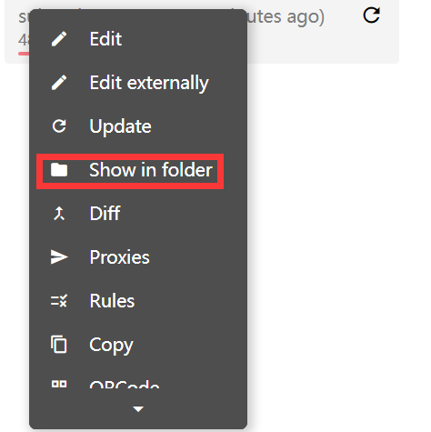

# Common-Linux-server-commands-and-configurations

This repository contains a list of common Linux server commands and configurations that I have found useful.

## How to add sign in without password

1. Generate a new SSH key pair on your local machine:

```bash
ssh-keygen -t rsa 
```

2. Find the public key file in the `C:/user/.ssh` directory, the file name is `id_rsa.pub`.

3. Copy the content of the public key file and paste it into the `~/.ssh/authorized_keys` file on the server.

```bash
cat id_rsa.pub >> ~/.ssh/authorized_keys
```

4. Change the permission of the `~/.ssh/authorized_keys` file to `600`.

```bash
chmod 600 ~/.ssh/authorized_keys
```

5. Now you can sign in to the server without a password.

## How to configure the VPN

1. Install the clash in this [website](https://glados.rocks/tools/clash-linux.zip)

2. Upload the `clash-linux.zip` file to the server. You can use WinSCP to upload the file.

3. Unzip the `clash-linux.zip` file.

```bash
unzip clash-linux.zip
```

4. Find your local configuration file in clash. And copy the configuration file to the server.



5. Give necessary permission to the configuration file.

```bash
chmod +x ./clash-linux-amd64-v1.10.0
```

6. Run the clash in the background. Replace `Tudo.yml` with your configuration file. And you should keep the terminal running. 

```bash
./clash-linux-amd64-v1.10.0 -f Tudo.yml
```

7. Export the proxy to the system.

```bash
export https_proxy=http://127.0.0.1:7890
export http_proxy=http://127.0.0.1:7890
```

8. Cancel the proxy.

```bash
unset https_proxy
unset http_proxy
```

## How to configure GitHub in the server

1. Generate a new SSH key pair on your server.

```bash
ssh-keygen
```

2. Find the public key file in the `~/.ssh` directory, the file name is `id_rsa.pub`.

3. Copy the content of the public key file and paste it into the SSH keys in the GitHub settings.

4. Filling the configuration using the following command.

```bash
git config --global user.name "your name"
git config --global user.email "your email"
```

5. Now you can change and upload the repository without a password.

## How to install the miniconda

1. Download the miniconda from the official website.

```bash
wget https://mirrors.tuna.tsinghua.edu.cn/anaconda/miniconda/Miniconda3-py312_24.4.0-0-Linux-x86_64.sh
```

2. Install the miniconda.

```bash
bash Miniconda3-py312_24.4.0-0-Linux-x86_64.sh
```

3. Add the miniconda to the system path.

```bash
export PATH=~/miniconda3/bin:$PATH
```

4. Refresh the system path.

```bash
source ~/.bashrc
```

5. Some useful commands.

```bash
conda create -n env_name python=3.7
conda activate env_name
conda deactivate
conda remove -n env_name --all
pip list --format=freeze > requirements.txt
pip install -r requirements.txt
```

## Install Pytorch-GPU

1. Look up the CUDA version.

```bash
nvidia-smi
```

2. Go to the official [website](https://pytorch.org/get-started/previous-versions/) to find the corresponding version of Pytorch.

3. Install the Pytorch.

```bash
conda install pytorch==2.0.1 torchvision==0.15.2 torchaudio==2.0.2 pytorch-cuda=11.7 -c pytorch -c nvidia
```

4. Test the Pytorch.

```python
import torch
torch.cuda.is_available()
torch.cuda.device_count()
torch.cuda.get_device_name(0)
```

## Setting bash as the default shell

If the bash is already installed, and now you are not using the bash, you can first use the following command to activate the bash and find the path of the bash.

```bash
bash
which bash
```

Then you can use the following command to set the bash as the default shell.

```bash
chsh -s /bin/bash
```

If you use VSCode, you can also set the bash as the default shell in the settings.

```json
{
  "terminal.integrated.defaultProfile.linux": "bash",
  "terminal.integrated.profiles.linux": {
    "bash": {
      "path": "/bin/bash"
    }
  }
}
```

## Useful Linux commands

1. Find the file in the current directory.

```bash
find . -name "filename"
```

2. Find the file in the current directory and delete it.

```bash
find . -name "filename" -delete
```

3. Delete the directory.

```bash
rm -rf directory
rm -rf *
```

4. Copy the file from the server to the local machine.

```bash
scp username@server:/path/to/file /path/to/file
```

5. Copy the file from the local machine to the server.

```bash
scp /path/to/file username@server:/path/to/file
```

6. Look the CPU information.

```bash
lscpu
```

7. Look the memory information.

```bash
free -h
```

8. Look the disk information.

```bash
df -h
```

9. Look the system information.

```bash
uname -a
```

10. Look up the size of the folder.

```bash
du -sh folder
```

## How to Download the file from Google Drive

1. Install the `gdown` package.

```bash
pip install gdown
```

2. Download the file from Google Drive.

```bash
gdown --id file_id
```

Tips: You can find the file_id in the share link, for example, the URL is `https://drive.google.com/file/d/file_id/view`, then the file_id is `file_id`.

3. Unzip the file.

```bash
unzip file_name
```